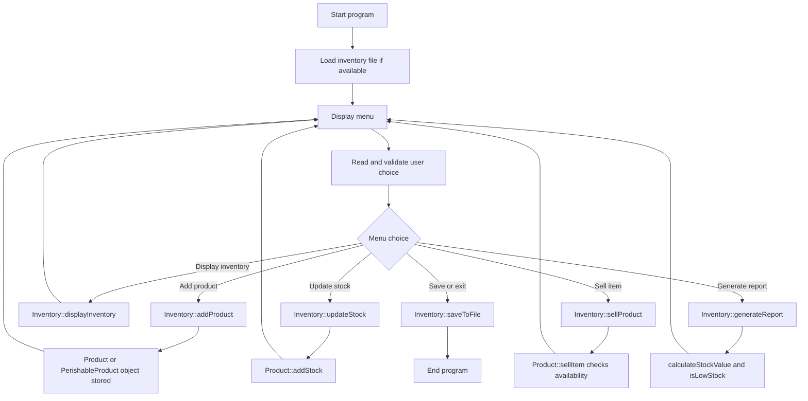

# Shop Inventory Management System

Project C Report | EPS Programming Project

## 1. Project Description

This project is a console-based inventory management system for a small shop. The program stores product records including product name, price, quantity in stock, supplier, and category. Users can add products, display the full inventory, add more stock, sell items, and generate a stock report. When an item is sold, the program checks whether enough stock is available before reducing the quantity, so the stock level cannot become negative. The report also calculates the total value of stock held and identifies products that are low in stock. The design uses separate classes for Product and Inventory so that product data and inventory operations are organised clearly. The program also includes file storage, so the inventory can be saved and loaded between runs. A PerishableProduct subclass is included as an extension to demonstrate inheritance for product categories.

## 2. Program Flow

Figure 1 shows the menu decision paths and the class methods used by each operation. It makes the control flow clear and shows where Product, PerishableProduct, and Inventory are used.

Figure 1. Flow chart for the shop inventory management program.

## 3. Class Structure

The implementation uses three main classes. Product represents one item in the shop. PerishableProduct inherits from Product and adds expiry-date information. Inventory owns the product collection and provides the menu operations required by the project brief.

| Class | Key member variables | Purposeful member functions |
|---|---|---|
| Product | name, price, quantity, supplier | addStock(), sellItem(), calculateStockValue(), isLowStock(), display(), toFileLine() |
| PerishableProduct | expiryDate plus inherited Product fields | Overrides getCategory() and getExtraInformation() to show category-specific data. |
| Inventory | vector of unique_ptr<Product> objects | addProduct(), displayInventory(), updateStock(), sellProduct(), generateReport(), saveToFile(), loadFromFile() |

## 4. Implemented Requirements

| Requirement from brief | How it is handled in the program |
|---|---|
| Store name, price, quantity, and supplier for each product. | The Product class stores these fields and provides getters and setters. |
| Represent each product as an object. | Each item is created as a Product or PerishableProduct object. |
| Add products and update stock levels. | Inventory::addProduct() creates records and Inventory::updateStock() adds stock. |
| Sell items without negative stock. | Product::sellItem() returns false if the requested sale is larger than current stock. |
| Display full inventory and useful information. | displayInventory() prints a formatted table and generateReport() prints stock value totals. |
| Identify low-stock items. | isLowStock() checks against the LOW_STOCK_LIMIT constant and report output lists matching products. |
| Input validation and clear feedback. | readLine(), readInt(), readDouble(), and readIntInRange() reject invalid entries and show corrective messages. |
| Possible extensions. | The program includes automatic low-stock alerts, file storage, and inheritance for perishable products. |

## 5. Testing

The program was compiled with Apple clang++ and tested with scripted console runs. The tests covered normal use, invalid menu input, invalid saved file data, and actions that should be rejected.

| Test case | Input or action | Expected result | Observed evidence |
|---|---|---|---|
| Invalid menu input | Enter abc, then 1abc at the menu. | Both inputs are rejected before a valid menu choice is accepted. | The console printed "Please enter a whole number of at least 1." twice. |
| Inheritance display | Add Milk as a general product and Yogurt as a perishable product. | The two product types display different category and notes information. | Milk displayed as "General" with notes "-"; Yogurt displayed as "Perishable" with "Expiry: 2026-06-15". |
| Reject over-selling | Milk stock is 4; try to sell 6 units. | Sale is rejected and stock remains unchanged. | Console output: "Sale rejected. There is not enough stock available." |
| Successful sale | Milk stock is 4; sell 3 units. | Quantity decreases from 4 to 1. | Console output: "Sale completed. Remaining stock: 1". |
| Low-stock alert | After selling Milk, its quantity is 1. | Program warns that Milk should be reordered. | Console output: "Low stock alert: this product should be reordered soon." |
| Stock report calculation | Generate report with Milk quantity 1 at $2.50 and Yogurt quantity 2 at $3.00. | Total value is calculated as 2.50 x 1 + 3.00 x 2 = 8.50, and both products are low stock. | Report output showed "Total value of stock: $8.50" and "Products currently low in stock: 2". |
| File save and reload | Save inventory, exit, restart the program, and display inventory. | Saved products are loaded again. | The second run displayed Milk and Yogurt from inventory.txt before any new products were added. |
| Bad file record | Load a saved record with a non-numeric price. | Invalid record is skipped without crashing. | The program printed a warning and continued loading valid records. |

## 6. Demonstration Notes

For the live demonstration, compile and run the program on the laboratory PC using a C++14-compatible compiler. The demonstration will show adding products, displaying inventory, updating stock, rejecting an invalid sale, completing a valid sale, generating a stock report, saving the inventory file, and reloading the saved data.

## 7. Submission Files

The files prepared for demonstration are the C++ source file, the inventory data file if required for testing, and a printed copy of this report.

| File | Purpose |
|---|---|
| Project_Starter_Code.cpp | Final C++ source code for the Shop Inventory Management System. |
| inventory.txt | Optional inventory data file used when demonstrating save and reload behaviour. |
| Shop_Inventory_Project_Report.docx | Printed report covering project description, flow, class structure, testing evidence, and demonstration notes. |
